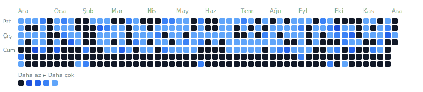

<!-- Visitor Badge -->
<!--  -->

<h2 align="center">
  Hi! I'm Merve 👋
</h2>
<h5 align="center">
  <code>
    <a href="https://www.linkedin.com/in/merve-tagci/" title="LinkedIn Profile"> LinkedIn</a></code>
  <code><a href="https://www.hackerrank.com/profile/mervetagci" title="HackerRank Profile"> HackerRank</a></code>
  <!-- <code><a href="https://medium.com/@mervetagci" title="Medium Profile"> Medium</a></code> -->
  <!-- <code><a href="" title="Instagram Profile"> Instagram</a></code> -->
</h5>

---

## 👩‍💻 About Me

Hi, I'm **Merve Tağcı**, an **Angular & Java/Spring Boot Developer** from Turkey.  
🌸 I love designing scalable frontend architectures, reusable components, and maintainable backend systems.  
🎓 Graduate of **Düzce University – Computer Engineering**.

- 💻 Currently working on enterprise applications using **Angular, PrimeNG, Java, Spring Boot, Oracle**
- 🎨 Interested in UI/UX patterns, component libraries, form-intensive application design
- ✍️ I write technical content on Medium: [Click here](https://medium.com/@mervetagci)
- 💬 You can reach me for collaboration or questions on: [LinkedIn](https://www.linkedin.com/in/merve-tagci/)
- 📫 Email: **mervetagci@gmail.com**

---

## 🛠️ Languages & Tools

  

---

## 📊 GitHub Stats

  

---

##  GitLab Activity Heatmap

  

  
    🔒 Since the corporate GitLab instance is restricted from external access, the activity heatmap is generated locally via a script instead of GitHub Actions, and is updated automatically.
  

---

